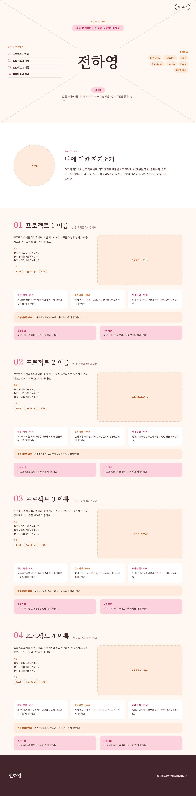
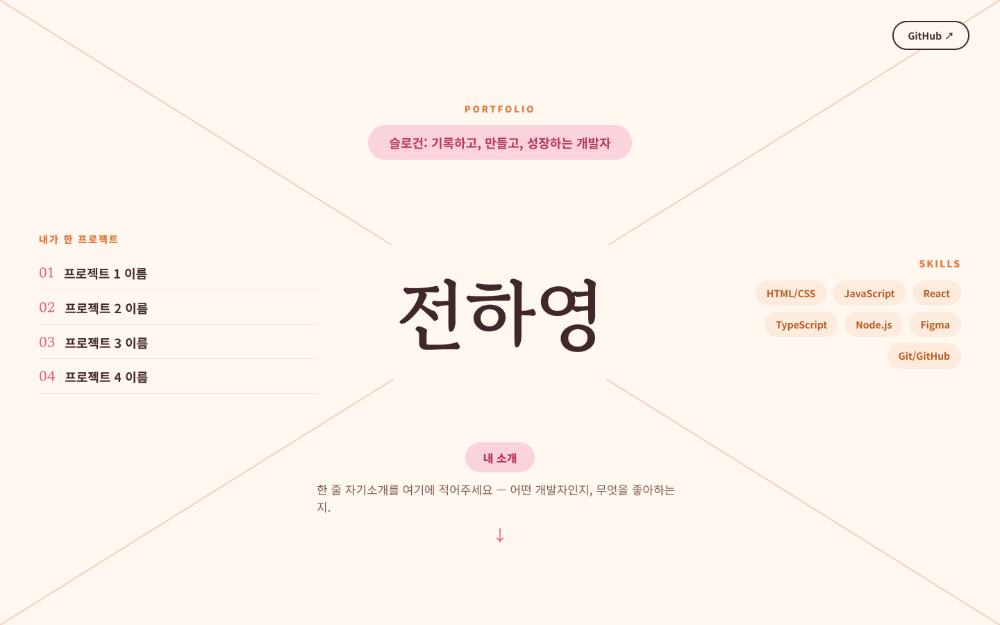
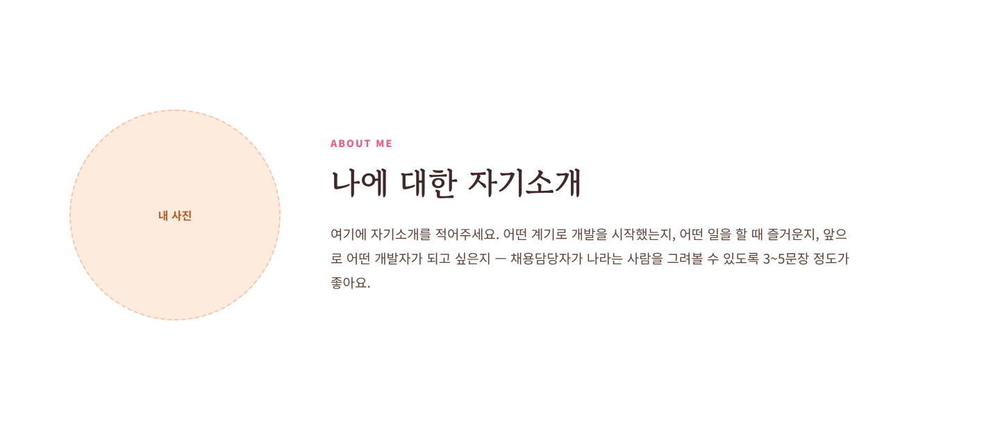
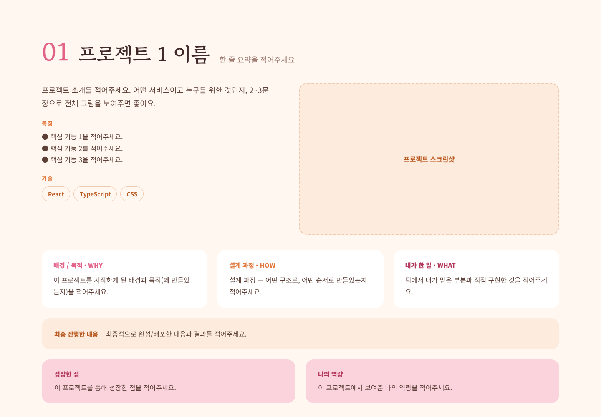

# 전하영 · Portfolio (portfolio_V2)

> 슬로건: 기록하고, 만들고, 성장하는 개발자

원페이지 스크롤형 포트폴리오 웹페이지입니다. 첫 화면에서 **내가 어떤 사람인지 한눈에** 보이도록, 이름을 중심으로 프로젝트·스킬·소개를 X자 레이아웃으로 배치했습니다.

**구성:** 히어로(이름·슬로건·프로젝트 목록·스킬) → 자기소개 → 프로젝트 4개(화면당 1개) → GitHub 푸터

## 실행 방법

`index.html`을 브라우저에서 열면 됩니다. (별도 빌드 불필요)

## 전체 화면

## 화면별 캡처

### 1. 히어로
이름을 가운데 두고 대각선으로 4분할 — 위: 슬로건 / 왼쪽: 프로젝트 목록 / 오른쪽: 스킬 / 아래: 내 소개.

### 2. 자기소개

### 3. 프로젝트 (한 화면에 하나씩)
각 프로젝트는 소개·특징·기술 / WHY·HOW·WHAT / 최종 진행 내용 / 성장한 점·나의 역량으로 정리했습니다.

### 4. 푸터

## 기술

- HTML / CSS (단일 파일, 인라인 스타일)
- 폰트: Gowun Batang, Noto Sans KR (Google Fonts)
